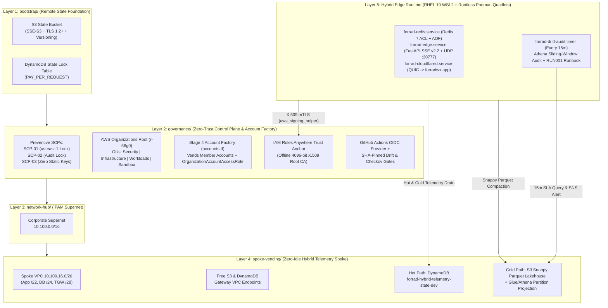

# Enterprise AWS Landing Zone & Hybrid Distributed Event Fabric (ForRad)

Production-grade, multi-account AWS Landing Zone and Hybrid Edge Telemetry Fabric engineered with **Terraform**, **AWS Organizations (SCPs & Stage 4 Account Factory)**, **AWS IAM Roles Anywhere (X.509 mTLS)**, **Rootless Podman Systemd Quadlets**, and **SHA-Pinned Shift-Left Policy-as-Code (Checkov + GitHub OIDC)**.

* **Live Production Tactical HUD:** [https://forradwx.app](https://forradwx.app)
* **Current Release Baseline:** `v0.6.0-stage4-account-factory`

---

## 1. Architecture & State Blast-Radius Isolation



```mermaid
flowchart TD
    subgraph L1["Layer 1: bootstrap/ (Remote State Foundation)"]
        S3State["S3 State Bucket<br/>(SSE-S3 + TLS 1.2+ + Versioning)"]
        DDBLock["DynamoDB State Lock Table<br/>(PAY_PER_REQUEST)"]
    end

    subgraph L2["Layer 2: governance/ (Zero-Trust Control Plane & Account Factory)"]
        SCPs["Preventive SCPs:<br/>SCP-01 (us-east-1 Lock)<br/>SCP-02 (Audit Lock)<br/>SCP-03 (Zero Static Keys)"]
        OrgRoot["AWS Organizations Root (r-56g0)<br/>OUs: Security | Infrastructure | Workloads | Sandbox"]
        AcctFactory["Stage 4 Account Factory (accounts.tf)<br/>Vends Member Accounts + OrganizationAccountAccessRole"]
        RolesAnywhere["IAM Roles Anywhere Trust Anchor<br/>(Offline 4096-bit X.509 Root CA)"]
        GitHubOIDC["GitHub Actions OIDC Provider +<br/>SHA-Pinned Drift & Checkov Gates"]
    end

    subgraph L3["Layer 3: network-hub/ (IPAM Supernet)"]
        Supernet["Corporate Supernet<br/>10.100.0.0/16"]
    end

    subgraph L4["Layer 4: spoke-vending/ (Zero-Idle Hybrid Telemetry Spoke)"]
        SpokeVPC["Spoke VPC 10.100.16.0/20<br/>(App /22, DB /24, TGW /28)"]
        Endpoints["Free S3 & DynamoDB<br/>Gateway VPC Endpoints"]
        HotDDB["Hot Path: DynamoDB<br/>forrad-hybrid-telemetry-state-dev"]
        ColdS3["Cold Path: S3 Snappy Parquet Lakehouse<br/>+ Glue/Athena Partition Projection"]
    end

    subgraph L5["Layer 5: Hybrid Edge Runtime (RHEL 10 WSL2 + Rootless Podman Quadlets)"]
        EdgeQuadlets["forrad-redis.service (Redis 7 ACL + AOF)<br/>forrad-edge.service (FastAPI SSE v2.2 + UDP :20777)<br/>forrad-cloudflared.service (QUIC -> forradwx.app)"]
        DriftTimer["forrad-drift-audit.timer (Every 15m)<br/>Athena Sliding-Window Audit + RUN001 Runbook"]
    end

    L1 --> L2 --> L3 --> L4
    L5 -- "X.509 mTLS (aws_signing_helper)" --> RolesAnywhere
    L5 -- "Hot & Cold Telemetry Drain" --> HotDDB
    L5 -- "Snappy Parquet Compaction" --> ColdS3
    DriftTimer -- "15m SLA Query & SNS Alert" --> ColdS3
```

---

## 2. FinOps Zero-Idle Cost Ledger (< $1.50/Month Cap | $0.00/Mo Idle | $0.51 MTD Actual)

| Architectural Layer | Prohibited Cloud Cost Trap | Avoided Cost | Implemented Zero-Idle Pattern | Idle Run-Cost |
| :--- | :--- | :--- | :--- | :--- |
| **1. Bootstrap (`bootstrap/`)** | Unencrypted Local State / Idle KMS CMKs | `$1.00+ / mo` | S3 Versioning + TLS 1.2+ + `PAY_PER_REQUEST` DynamoDB Lock | **~$0.03 / mo** |
| **2. Governance & Account Factory (`governance/`)** | AWS Private CA (`$400/mo`) & Paid Control Plane Add-ons | `$400.00 / mo` | Offline X.509 Root CA + IAM Roles Anywhere + Organizations Account Factory (`accounts.tf`) | **$0.00 / mo** |
| **3. Network Hub (`network-hub/`)** | Idle Transit Gateway Attachments | `$36.00 / mo` | Pre-staged `/28` TGW Subnets (`enable_tgw_attachment = false`) | **$0.00 / mo** |
| **4. Spoke & Lakehouse (`spoke-vending/`)** | Managed NAT Gateways (`$32/mo`) & ALBs (`$16/mo`) | `$85.00+ / mo` | S3/DynamoDB Gateway VPC Endpoints + `PAY_PER_REQUEST` DynamoDB + S3 Snappy Parquet + Athena Projection | **$0.00 / mo** |
| **5. Hybrid Edge & CI/CD (`edge-broker/`, `deploy/quadlets/`)** | Always-On Cloud Compute (ECS/EC2) & Static IAM Keys | `$35.00+ / mo` | Rootless Podman Quadlets + Cloudflare Anycast QUIC Tunnel + 15m Systemd Drift Timer + GitHub OIDC | **$0.00 / mo** |


### 2.1 Empirical FinOps Telemetry: Dissecting the $0.51 MTD Spend (`COST01-BP09` / `COST03-BP01`)

While the infrastructure's **idle baseline is $0.00/month** (zero NAT Gateways, zero ALBs, zero active KMS CMK retainers via `ADR-007`), active high-frequency NEXRAD telemetry ingestion and chaos testing incurred **$0.51 USD Month-to-Date (MTD)** in Account `052535487590`:

| AWS Service | MTD Actual (`us-east-1`) | % of Spend | Root Cause & Engineering Remediation (`v2.3` Watermark Optimization) |
| :--- | :--- | :--- | :--- |
| **Amazon S3 (`Requests-Tier1`)** | **$0.36** (`$0.3374` unblended) | **66.8%** | **Root Cause:** AWS Free Tier includes only `2,000` S3 `PUT` requests/month (`$0.005` per `1,000` PUTs thereafter). Early `v2.1` micro-batching flushed 4 single-row (`rows=1`) Snappy Parquet files (`KBMX`, `KHTX`, `KMXX`, `KMOB`) every 60s (`5,760 PUTs/day`), triggering a `$1.29` forecasted `WXDash-Dollar-Tripwire` budget alert.<br>**Fix (`v2.3`):** Engineered a 15-minute sliding-window watermark compactor using Redis `XINFO GROUPS` (`last-delivered-id`), reducing S3 `PUT` velocity by **93.3%** (`384 PUTs/day` -> **`< $0.06/mo`** steady-state). |
| **Amazon DynamoDB** | **$0.06** (`$0.0543` unblended) | **10.8%** | On-Demand (`PAY_PER_REQUEST`) write units consumed while draining an `8,866`-frame resilience backlog (`hdef_cloud_sync`) after simulated WAN/host power recovery (`REL11-BP03`). |
| **AWS KMS** | **$0.05** (`$0.0373` unblended) | **7.4%** | Historical prorated runtime (~6 days in Oct) prior to replacing the `$1.00/mo` Customer Managed Key with `SSE-S3` (`AES256`) and AWS-Owned keys per `ADR-007`, plus `~12,400` cryptographic API requests above the `20,000/mo` Free Tier (`$0.03` per `10k` requests). |
| **AWS Cost Explorer API** | **$0.04** (`$0.0400` unblended) | **7.9%** | **FinOps Discovery:** While the AWS Cost Explorer web UI is `$0.00`, AWS bills **`$0.01` per `aws ce get-cost-and-usage` CLI call** with no Free Tier (`4 CLI audits = $0.04`). Standardized on browser console & AWS Budgets alerts (`$0.00/mo`). |
| **Amazon Athena & CloudWatch** | **$0.01** (`$0.0059` unblended) | **1.2%** | 15-minute sliding-window Golden Storm SQL drift queries (`forrad-drift-audit.timer`) scanning Snappy-compressed Parquet partitions (`$5.00/TB` scanned). |
| **Total Pre-Tax / Grand Total** | **$0.51 USD** | **100%** | **Steady-State Post-v2.3 Run-Rate: `< $0.15 / month`** (Safely below the `$1.00` `WXDash-Dollar-Tripwire` and `$5.00` monthly cap). |

---

## 3. Empirical Verification Artifacts & Operational Runbooks

* [Architecture Decision Records — Complete Chronological Register (`ADR-001` to `ADR-010`)](docs/adr/ADR_INDEX.md)
* [ADR-010: Stage 4 Multi-Account Vending Factory & SHA-Pinned CI/CD Supply Chain](docs/adr/ADR-010-multi-account-vending-and-supply-chain.md)
* [Correction of Error `COE-001`: S3 Tier-1 `PUT` Micro-Batch Exhaustion & `v2.3` Watermark Compaction (`COST01-BP09`)](docs/postmortems/COE-001-s3-tier1-put-compaction.md)
* [Correction of Error `COE-002`: WSL2 ACPI Sleep Recovery, Split-Horizon DNS & SSE Anti-Buffering (`REL12-BP02`)](docs/postmortems/COE-002-wsl2-acpi-sleep-and-sse-buffering.md)
* [Security Incident Playbook `PLAY001`: Edge X.509 mTLS Compromise & Control-Plane Drift Containment (`SEC10-BP04`)](docs/playbooks/PLAY001-edge-identity-and-oidc-containment.md)
* [Operational Readiness Review `ORR-001`: Data Lifecycle, RTO/RPO Targets & Safe Decommissioning (`REL13-BP01`)](docs/operations/ORR-data-lifecycle-and-rto.md)
* [Phase 1: Zero-Trust X.509 mTLS & Blast-Radius Canary Proof](docs/verification/phase1_mtls_canary_proof.md)
* [Phase 2B: Queue-First Redis Streams Backplane & Silent-Failure Guardrails Proof](docs/verification/phase2b_redis_streams_proof.md)
* [Phase 3.2: Edge Caching, CI/CD Secret Injection, & Zero-Drift Validation Proof](docs/verification/phase3_2_edge_cache_proof.md)
* [Phase 4 & 5: Cloudflare Anycast QUIC Ingress, HSTS Preload, & SSE Anti-Buffering Proof](docs/verification/phase4_production_ingress_proof.md)
* [Phase 3 Track A: S3 Snappy Parquet Cold Lakehouse & Athena Partition Projection Proof](docs/verification/sprint2_track_a_lakehouse_proof.md)
* [Phase 3 Track B: FastAPI Multiplexed SSE Broadcaster & Last-Event-ID Replay Proof](docs/verification/sprint2_track_b_sse_proof.md)
* [Phase 3 Track C: Closed-Loop Golden Storm Athena Drift Detector & SNS Andon Proof](docs/verification/sprint3_drift_engine_proof.md)
* [Operational Incident Runbook: `RUN001-drift-remediation.md` (`OPS07-BP03`)](docs/runbooks/RUN001-drift-remediation.md)

---

## 4. Zero-Trust Split-Domain Edge Ingress (`forradwx.app` & `forradwx.com`)

* **Primary Telemetry Gateway ([https://forradwx.app](https://forradwx.app)):** Enforces strict `.app` HSTS preload transport security, terminating public client traffic at the Cloudflare Anycast edge and routing via outbound-only `cloudflared` QUIC tunnels into the local rootless Podman `forrad-edge` broker (`X-Accel-Buffering: no`, `<1ms` SSE preamble flush, and 15-second keepalive heartbeats with zero open WAN firewall ports).
* **Discovery & Canonical Redirect (`https://forradwx.com`):** Executes an edge-level `HTTP 301 Moved Permanently` redirect to `https://forradwx.app` to preserve single-origin CORS pinning and cache locality.

---

## 5. Stage 4 Multi-Account Vending Factory (`governance/accounts.tf`)

Member accounts (`forrad-log-archive`, `forrad-security-tooling`, `forrad-network-hub`, `forrad-workloads-prod`) are codified in `governance/accounts.tf` (`SEC01-BP01`, `SEC01-BP02`, `REL01-BP03`) with `default = {}` to preserve zero cloud drift during hold periods. To preview or vend a member account into its target OU with serialized control-plane safety (`-parallelism=1`):

```bash
terraform -chdir=governance plan -parallelism=1 \
  -var='vended_accounts={"workloads_prod":{"name":"forrad-workloads-prod","email":"admin+forrad-prod@forradwx.com","ou_key":"workloads","environment":"prod"}}'
```
